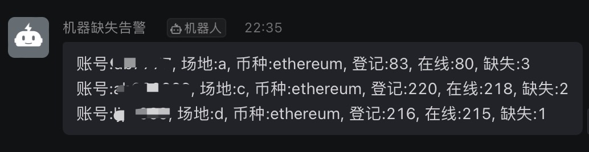

相关核心代码已隐藏，如有部署需要或是wa kuang需求，可联系：
tg:+86 17602136387
微信同号。

# 鱼池监控产品

## 产品介绍

访问鱼池提供的api，对返回数据进行整合处理，输出总结性信息。

对场地运维工程师和个人矿工而言，通过程序周期性的告知场地机器的异常情况，可以省略逐个翻账户检查的繁琐步骤，也可达到及时发现、及时反馈、及时处理的目的。

## 目前功能

周期性(如每隔15分钟、每隔1小时等，可设定)发送告警，支持监控F2Pool所接受的所有币种。

- 基础功能
  - 机器离线的告警。
- 进阶功能
  - 算力告警：算力低于阈值的告警。
  - 丢失告警：因各种原因(如离线过久跌出矿池)导致账户中某些机器在矿池中丢失(账户应有30台，但是只显示有27台，则说明有3台未在工作状态，需补充进来)。
  - 数据分析：生成每日状态图表报告并发送邮箱，可通过报告分析是否有某些机器离线时间较长、频繁离线或是算力频繁、持续低位，尽早发现机器问题并着手处理。

## 告警方式
邮件、钉钉、企业微信、telegram

## 效果(以钉钉为例)
### 账户离线报告

### 算力过低报告

### 机器缺失告警

